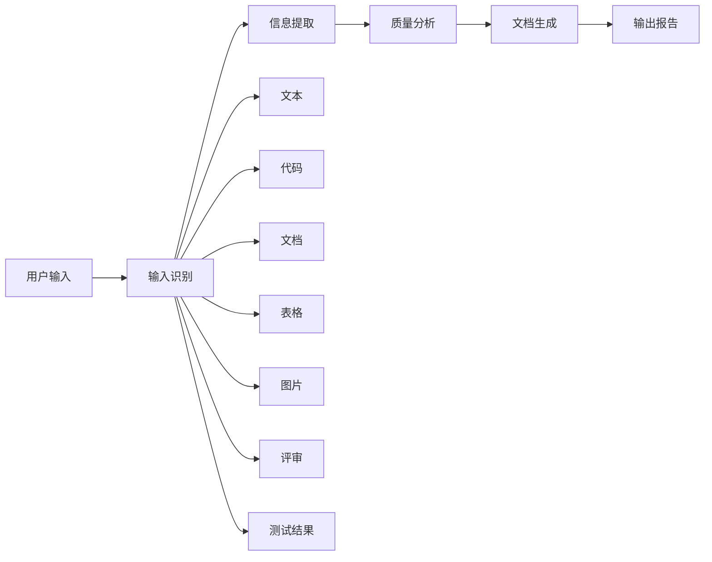

# Quality Document Generator / 质量管理文档助手

整合多源信息，生成质量周期所需的各类文档。

---

## 核心能力

### 1. 多格式输入处理

| 输入类型 | 支持格式 | 处理方式 |
|---------|---------|---------|
| **文本** | 纯文本、Markdown | 直接解析 |
| **代码** | 任意编程语言源码 | 代码分析 |
| **文档** | Word (.docx)、PDF | 结构化提取 |
| **表格** | Excel (.xlsx)、CSV | 数据提取 |
| **图片** | PNG、JPG、截图 | 文字识别(OCR) |
| **评审** | GitHub PR评论、Markdown | 意图分类 |
| **测试结果** | JUnit XML、pytest JSON、Jest JSON | 结果解析 |

### 2. 文档生成能力

| 文档类型 | 说明 | 标准 |
|---------|------|------|
| 测试计划 | 定义测试范围、方法、资源 | IEEE 829 |
| 测试用例规格 | 详细用例定义 | IEEE 829 |
| 测试程序规格 | 执行步骤定义 | IEEE 829 |
| 测试日志 | 执行过程记录 | IEEE 829 |
| 测试事件报告 | 缺陷/问题记录 | IEEE 829 |
| 测试总结报告 | 测试结果汇总 | IEEE 829 |
| 质量评估报告 | 综合质量评价 | ISO 25010 |
| 风险评估报告 | 项目风险分析 | ISO 31000 |
| 评审摘要报告 | 代码评审整合 | 自定义 |
| 经验教训报告 | 项目总结 | 自定义 |

### 3. 质量维度评估

基于 ISO 25010 质量模型评估：

| 维度 | 评估指标 |
|------|---------|
| 功能性 | 测试通过率、需求覆盖率 |
| 性能效率 | 响应时间、吞吐量 |
| 可靠性 | 缺陷密度、MTTR |
| 安全性 | 安全问题数、漏洞评估 |
| 可维护性 | 代码复杂度、重复率 |

---

## 工作流程



详见: `references/workflows/main-workflow.md`

---

## 使用方式

### 触发方式

**手动触发:**
- "生成这个项目的测试计划"
- "分析代码质量并生成报告"
- "整理这些评审记录生成报告"
- "根据测试结果生成测试总结报告"
- "生成质量评估报告"

**批量输入:**
- 直接粘贴文本内容
- 提供文件路径
- 提供多个信息源

### 输入示例

```
用户: "分析这个测试报告，生成测试总结报告"
输入: [粘贴pytest JSON内容]

用户: "生成项目质量评估"
输入:
- 代码: src/ 目录
- 测试: test-results/junit.xml
- 评审: PR #123 的评论记录
```

---

## 输出配置

| 配置项 | 说明 | 默认值 |
|-------|------|--------|
| `outputFormat` | 输出格式 | markdown |
| `standard` | 采用标准 | IEEE 829 |
| `detailLevel` | 详细程度 | standard |
| `includeRawData` | 包含原始数据 | false |

---

## 输入处理

详细处理方式见 `references/input-handlers/` 目录：

| 处理器 | 支持格式 | 用途 |
|-------|---------|------|
| text-parser | 纯文本、Markdown | 通用文本解析 |
| code-parser | 所有编程语言 | 代码质量和结构分析 |
| document-parser | Word (.docx), PDF | 文档内容提取 |
| spreadsheet-parser | Excel (.xlsx), CSV | 表格数据提取 |
| image-parser | PNG, JPG, BMP | OCR文字识别 |
| review-parser | GitHub PR, Markdown | 评审意见分类 |
| test-result-parser | JUnit, pytest, Jest | 测试结果解析 |

---

## 文档模板

模板位置: `references/templates/`

| 模板 | 文件名 | 用途 |
|------|--------|------|
| 测试计划 | 01-test-plan.md | 定义测试范围和方法 |
| 测试用例规格 | 02-test-case-spec.md | 用例详细定义 |
| 测试程序规格 | 03-test-procedure-spec.md | 执行步骤 |
| 测试日志 | 04-test-log.md | 执行记录 |
| 测试事件报告 | 05-test-incident-report.md | 缺陷记录 |
| 测试总结报告 | 06-test-summary-report.md | 结果汇总 |
| 质量评估报告 | 07-quality-assessment.md | 综合质量评价 |
| 风险评估报告 | 08-risk-assessment.md | 风险分析 |
| 评审摘要报告 | 09-review-summary.md | 评审整合 |
| 经验教训报告 | 10-lessons-learned.md | 项目总结 |

---

## 质量评分算法

```python
def calculate_quality_score(data):
    """
    综合质量评分 (0-100)
    基于 ISO 25010 质量模型
    """
    weights = {
        'functional': 0.30,    # 功能性
        'reliability': 0.25,   # 可靠性
        'performance': 0.15,   # 性能效率
        'security': 0.15,      # 安全性
        'maintainability': 0.15 # 可维护性
    }

    scores = {}
    scores['functional'] = calculate_functional_score(data)
    scores['reliability'] = calculate_reliability_score(data)
    scores['performance'] = calculate_performance_score(data)
    scores['security'] = calculate_security_score(data)
    scores['maintainability'] = calculate_maintainability_score(data)

    total = sum(scores[k] * weights[k] for k in weights)
    return min(100, max(0, total)), scores
```

详见: `references/standards/quality-model.md`

---

## 错误处理

| 情况 | 处理方式 |
|------|---------|
| 输入格式不支持 | 请求用户转换为支持的格式 |
| 输入内容不足 | 标注需要补充的信息 |
| 部分解析失败 | 生成部分报告 + 标注未解析内容 |
| 缺少必需字段 | 说明缺少的字段，请求补充 |

---

## 参考资料

- `references/workflows/main-workflow.md` - 主工作流程
- `references/input-handlers/` - 输入处理器详解
- `references/templates/` - 文档模板
- `references/standards/` - 行业标准参考
