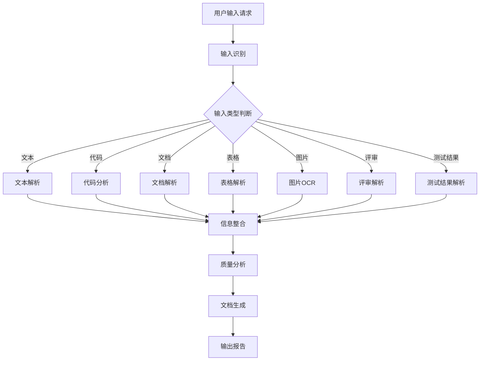

# Main Workflow / 主工作流程

## 概述

质量管理文档生成的主工作流程，包括输入处理、信息整合、质量分析和文档生成四个阶段。

---

## 流程图



---

## 阶段一：输入识别与解析

### 1.1 输入识别

| 输入类型 | 识别方式 | 示例 |
|---------|---------|------|
| 纯文本 | 直接识别 | 粘贴的文字内容 |
| Markdown | 识别markdown格式 | ```markdown ... ``` |
| 代码 | 识别代码语法 | ```python / ```javascript |
| 文件路径 | 识别文件扩展名 | `/path/to/report.xlsx` |
| 图片 | 识别图片格式 | base64或文件路径 |
| 测试结果 | 识别JSON/XML结构 | JUnit XML、pytest JSON |

### 1.2 输入解析器

详见 `references/input-handlers/` 目录

| 解析器 | 处理逻辑 |
|-------|---------|
| text-parser | 直接提取文本内容，识别结构化标记 |
| code-parser | 解析代码结构，分析复杂度、依赖、问题 |
| document-parser | 提取Word/PDF中的段落、表格、标题 |
| spreadsheet-parser | 提取Excel/CSV中的表格数据和公式 |
| image-parser | OCR识别图片中的文字 |
| review-parser | 识别评审意见，分类严重性 |
| test-result-parser | 解析测试结果XML/JSON，提取统计数据 |

---

## 阶段二：信息整合

### 2.1 整合规则

```
┌─────────────────────────────────────────────────────────────┐
│                      信息整合层                              │
├─────────────────────────────────────────────────────────────┤
│                                                             │
│  代码信息 ──┐                                               │
│            ├──▶ 项目结构 ──┐                               │
│  评审信息 ──┤               ├──▶ 统一数据模型               │
│            │               │                               │
│  测试信息 ──┼──▶ 质量数据 ──┘                               │
│            │               │                               │
│  文档信息 ──┤               │                               │
│            │               │                               │
│  其他信息 ──┘               ▼                               │
│                     [ 质量分析引擎 ]                         │
│                                                             │
└─────────────────────────────────────────────────────────────┘
```

### 2.2 统一数据模型

```python
class QualityData:
    """质量管理统一数据模型"""

    # 项目信息
    project: ProjectInfo

    # 代码信息
    code_metrics: CodeMetrics
    code_structure: CodeStructure
    code_issues: List[CodeIssue]

    # 测试信息
    test_results: TestResults
    test_coverage: TestCoverage
    test_cases: List[TestCase]

    # 评审信息
    reviews: List[ReviewComment]
    review_summary: ReviewSummary

    # 文档信息
    documents: List[DocumentInfo]

    # 质量指标
    quality_metrics: QualityMetrics

class QualityMetrics:
    """质量指标"""
    functional_score: float      # 功能性评分
    reliability_score: float     # 可靠性评分
    performance_score: float      # 性能评分
    security_score: float        # 安全性评分
    maintainability_score: float # 可维护性评分
    overall_score: float         # 综合评分
```

### 2.3 信息映射

| 来源 | 提取内容 | 映射到 |
|------|---------|--------|
| 代码 | 复杂度、重复率、依赖 | 代码质量指标 |
| 测试结果 | 通过率、失败数、覆盖率 | 可靠性指标 |
| 评审 | 问题数、严重性分布 | 质量评估 |
| 文档 | 结构化内容 | 补充上下文 |
| 图片 | 截图中的错误信息 | 缺陷记录 |

---

## 阶段三：质量分析

### 3.1 分析维度

| 维度 | 分析内容 | 数据来源 |
|------|---------|---------|
| **功能性** | 需求覆盖、测试通过率 | 测试结果、代码 |
| **可靠性** | 缺陷密度、MTTR、失败模式 | 测试结果、评审 |
| **性能** | 响应时间、资源使用 | 测试结果、代码 |
| **安全性** | 安全问题、漏洞 | 代码扫描、评审 |
| **可维护性** | 代码复杂度、重复率 | 代码分析 |

### 3.2 分析规则

```python
def analyze_quality(data: QualityData) -> QualityAnalysis:
    """质量分析"""

    analysis = QualityAnalysis()

    # 1. 功能性分析
    analysis.functional = analyze_functional(data)

    # 2. 可靠性分析
    analysis.reliability = analyze_reliability(data)

    # 3. 性能分析
    analysis.performance = analyze_performance(data)

    # 4. 安全性分析
    analysis.security = analyze_security(data)

    # 5. 可维护性分析
    analysis.maintainability = analyze_maintainability(data)

    # 6. 综合评分
    analysis.overall = calculate_weighted_score(analysis)

    return analysis
```

### 3.3 阈值定义

| 指标 | 绿色(通过) | 黄色(警告) | 红色(不通过) |
|------|-----------|-----------|-------------|
| 测试通过率 | ≥ 95% | 85-95% | < 85% |
| 代码覆盖率 | ≥ 80% | 70-80% | < 70% |
| 缺陷密度 | < 5/KLOC | 5-10/KLOC | > 10/KLOC |
| 复杂度 | < 10 | 10-15 | > 15 |
| 综合评分 | ≥ 80 | 60-80 | < 60 |

---

## 阶段四：文档生成

### 4.1 文档选择

| 用户请求 | 生成文档 | 模板 |
|---------|---------|------|
| "测试计划" | 测试计划 | 01-test-plan.md |
| "测试用例" | 测试用例规格 | 02-test-case-spec.md |
| "测试报告" | 测试总结报告 | 06-test-summary-report.md |
| "质量评估" | 质量评估报告 | 07-quality-assessment.md |
| "风险评估" | 风险评估报告 | 08-risk-assessment.md |
| "评审总结" | 评审摘要报告 | 09-review-summary.md |
| "项目总结" | 经验教训报告 | 10-lessons-learned.md |
| "全面报告" | 所有适用文档 | 全部模板 |

### 4.2 生成流程

```
用户请求 ──▶ 确定文档类型 ──▶ 选择模板
                              │
                              ▼
                      填充数据模型
                              │
                              ▼
                      应用质量分析
                              │
                              ▼
                      生成最终文档
                              │
                              ▼
                        输出结果
```

### 4.3 模板填充

```python
def generate_document(template: str, data: QualityData, analysis: QualityAnalysis) -> str:
    """文档生成"""

    content = template

    # 替换项目信息
    content = content.replace("{project_name}", data.project.name)
    content = content.replace("{date}", data.project.date)

    # 替换质量指标
    content = content.replace("{overall_score}", str(analysis.overall))
    content = content.replace("{functional_score}", str(analysis.functional.score))

    # 替换详细数据
    content = content.replace("{test_pass_rate}", f"{data.test_results.pass_rate}%")
    content = content.replace("{total_tests}", str(data.test_results.total))

    # ... 更多替换

    return content
```

---

## 交互模式

### 模式一：完整请求

```
用户: "根据以下信息生成完整的测试总结报告和质量评估报告"
输入: [完整的测试结果、代码分析、评审记录]

处理: 全部自动完成
输出: 多份完整文档
```

### 模式二：增量请求

```
用户: "基于上次的分析，补充评审信息生成评审摘要"

处理:
  1. 读取上次的分析结果
  2. 整合新的评审信息
  3. 生成评审摘要

输出: 评审摘要报告
```

### 模式三：引导式请求

```
系统: "需要生成质量评估报告，请提供以下信息：
  1. 测试结果文件 (JUnit XML / pytest JSON)
  2. 代码目录路径
  3. 评审记录（如有）

用户: [逐步提供信息]
系统: [逐步确认和解析]
...
输出: 质量评估报告
```

---

## 输出格式

| 格式 | 说明 |
|------|------|
| markdown | 默认输出，通用性好 |
| html | 适合浏览器查看 |
| json | 程序化处理 |
| pdf | 适合存档打印 |

---

*由 quality-document-generator skill 自动生成*
